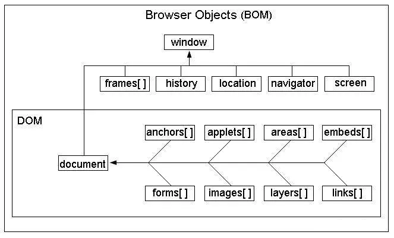

## `window`对象



BOM的核心对象就是`window`，`window`对象也是BOM的顶级对象，nodejs他的顶层对象global，所有浏览器都支持`window`对象，它代表的是浏览器的某个窗口(不是指的全部窗口)。

JavaScript的所有全局对象、全局方法和全局变量全都自动被归为`window`对象的方法和属性，在调用这些方法和属性的时候可以省略`window`。DOM也是`window`对象的属性。

```js
window.document //等价于 document
window.console.log() // 等价于console.log()
```

### window常用属性

#### innerWidth&innerHeight

由于兼容问题所以IE8以下不支持

返回窗口的文档显示区的高度及宽度 即一个屏幕的宽度不包含开发者工具书签及地址栏等等

与之类似的方法 document.documetElement.clientWidth/clientHeight 及document.body.clientHeight

```javascript
var screenWidth = innerWidth || document.documetElement.clientWidth || document.body.clientWidth;
var screenHeight = innerHeight || document.documentElement.clientHeight || document.body.clientHeight;
```

#### outerWidth&outerHeight

拿到整个窗口的完整宽高度 即包含文档显示区在内的 开发者工具 书签栏及地址栏等等

#### 　　screenLeft&screenTop&screenX&screenY

screenLeft和screenX 表示浏览器窗口的左上角那个点与整个屏幕显示内容区(不是指的浏览器)左边栏的距离

screenTop和screenY 表示浏览器窗口的左上角那个点与整个屏幕显示内容区(不是指的浏览器)上边栏的距离

### window常用方法

#### alert 弹出框

#### confirm 确认框

#### prompt 信息框

#### setTimeout&setIntervel&clearTimeout&clearInterval 定时器

#### open

新建一个窗口

```javascript
window.open(strUrl, strWindowName, [strWindowFeatures])	//返回一个window对象
```

+ strUrl: 将要打开的路径地址(绝对路径相对路径都可以)

+ strWindowName: 一般情况需要给这个新的窗口提供一个名字 同时可以通过那个窗口的name属性来获取名字

  + `_blank` 在新窗口打开，默认设置为`_blank`
  + `_self` 在原窗口打开，替代原窗口
  + `_parent` 在父框架中打开
  + name 指定在某个窗口打开

+ strWindowFeatures: 一个可选参数，列出新窗口的特征(大小，位置，滚动条等) 

  ```javascript
  window.open("", "", "width=200px,height=200px")		//开启一个200宽高的新窗口 注意是字符串,注意是单等号赋值
  ```

  

  | 属性名                    | 属性描述                                                     |
  | ------------------------- | ------------------------------------------------------------ |
  | channelmode=yes\|no\|1\|0 | 是否使用剧院模式显示窗口。默认为 no。                        |
  | directories=yes\|no\|1\|0 | 是否添加目录按钮。默认为 yes。                               |
  | fullscreen=yes\|no\|1\|0  | 是否使用全屏模式显示浏览器。默认是 no。处于全屏模式的窗口必须同时处于剧院模式。 |
  | height=pixels             | 窗口文档显示区的高度。以像素计。                             |
  | left=pixels               | 窗口的 x 坐标。以像素计。                                    |
  | location=yes\|no\|1\|0    | 是否显示地址字段。默认是 yes。                               |
  | menubar=yes\|no\|1\|0     | 是否显示菜单栏。默认是 yes。                                 |
  | resizable=yes\|no\|1\|0   | 窗口是否可调节尺寸。默认是 yes。                             |
  | scrollbars=yes\|no\|1\|0  | 是否显示滚动条。默认是 yes。                                 |
  | status=yes\|no\|1\|0      | 是否添加状态栏。默认是 yes。                                 |
  | titlebar=yes\|no\|1\|0    | 是否显示标题栏。默认是 yes。                                 |
  | toolbar=yes\|no\|1\|0     | 是否显示浏览器的工具栏。默认是 yes。                         |
  | top=pixels                | 窗口的 y 坐标。                                              |
  | width=pixels              | 窗口的文档显示区的宽度。以像素计。                           |


#### close 

[window].close() 关闭窗口

## `document` 对象

雷同DOM知识点

## `frames` 对象

注意! frame和frameset已经被HTML5标准直接移除!!!

仅仅只保留了iframe

## `location` 对象

`window.location`可以用户获取当前页面地址以及重定向到一个新的页面。

####  `location`的属性

- `window.location.href` 返回当前页面的地址
  - 既可以做getter也可以做setter
- `window.location.hostname` 返回当前页面的域名
- `window.location.pathname` 包含URL中路径部分内容，开头有一个`“/"`。
- `window.location.search` 包含URL中路径部分内容，开头有一个`“?"`。
  - getter/setter
- `window.location.hash` 包含URL中路径部分内容，开头有一个`“#"`。
  - 既可以做getter也可以做setter
- `window.location.protocol` 返回网页使用的协议（http: 还是 https:）
- `window.location.port` 返回当前页面的端口，如果页面使用的是默认端口（http:80,https:443），则大多数浏览器会显示为0或者不显示

#### `location`的方法

+ **reload()** 页面重刷新
+ **assign()** 跳转到指定页面 会记录到历史对象中
+ **replace()** 用新页面替换当前页面 不会记录到历史对象中

## `navigator` 对象

navigator.userAgent 返回一些包含浏览器,操作系统之类的一些信息

+ Trident IE内核
+ AppleWebKit 苹果/谷歌 (Opera现在使用)内核
+ Presto Opera(欧鹏老版本)内核
+ Gecko 火狐内核
+ Mobile 移动端
+ iPhone iOS系统
+ Android Android系统

navigator.onLine 确定浏览器是否在线

## `history` 对象

History.back() 等同于 History.go(-1) 等同于用户点击了退回到上一页

History.forward() 等同于 History.go(1) 等同于用户点击了前进到下一页

History.go(delta)  表示去前几页或后几页 数字类型

```javascript
// 本地重载方法 等同于 window.location.reload()
window.history.go();
window.history.go(0);
```

## `screen` 对象

`screen.width` 显示屏的宽度

`screen.height` 显示屏的高度

`screen.availWidth` 屏幕的可用宽度 减去(window||mac 工具栏的宽度)

`screen.availHeight` 屏幕的可用高度